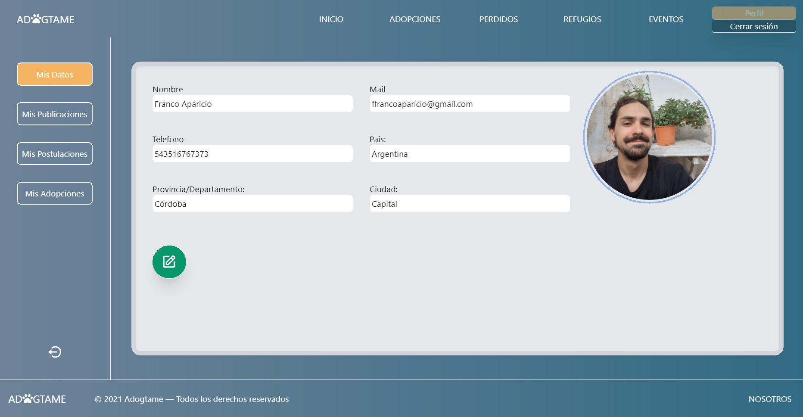

# ADOGTAME

> Enlaces:

## [Deploy](https://adogtame.vercel.app)

## [Video Demo WEB](https://youtu.be/PbN0Yg7HvHg)

## [Video Demo APP móvil](https://youtu.be/9RtzlPIem2E)

#

## Objetivo

El objetivo de _Adogtame_ es conectar **animales en adopción/perdidos/encontrados** con **personas que buscan adoptar o que extraviaron a su mascota.** Además la aplicación es una herramienta para que **refugios de animales** puedan publicar su ubicación y horarios de visita, listar sus mascotas disponibles, organizar eventos y hasta compartir un enlace en el cual puedan recibir donaciones y apoyo comunitario.

La idea surge a partir de la falta de un sitio que nuclee estas necesidades: actualmente este tipo de información está esparcida en diferentes redes sociales, entonces una aplicación como _Adogtame_ facilita el proceso de darle un hogar a una mascota que lo necesita, y a encontrar mascotas extraviadas que necesitan urgentemente volver a sus casas.

Las publicaciones en _Adogtame_ funcionan a base de geolocalización, por lo que la búsqueda y filtrado de mascotas se ve particularmente mejorada, especialmente en el caso de mascotas extraviadas, ya que un usuario al postear una mascota en esta sección debe proporcionar la zona en donde se perdió el animal, facilitando la urgente búsqueda.

<!-- Faltaría agregar un apartado de la app móvil -->

> Vista de búsqueda por mapa, disponible para Mascotas en adopción, Mascotas extraviadas, y Refugios de animales.
> 

## Requerimientos

> Variables de entorno usadas:

### Archivo .env en carpeta /Api

`PORT=` Número de puerto en el que correrá la database  
`DB_USER=` Nombre de usuario de Postgres  
`DB_PASSWORD=` Contraseña del usuario de Postgres  
`DB_HOST=` 'localhost'  

### Archivo .env en carpeta /Client/my-app

`REACT_APP_MAPS_KEY=` Clave API de _Google Develop_  
`REACT_APP_FIREBASE_KEY=` Clave API de _Firebase_  

 

> Versiones de dependencias:

React: ^17.0.2 
Tailwindcss: ^2.2.16 
@React-google-maps/api: ^2.4.1 
Google-map-react: ^2.1.10 
@Material-ui/core: ^4.12.3 
Firebase: ^9.1.1 
Axios: ^0.21.4 
Dotenv: ^8.2.0 
Jsonwebtoken: ^8.5.1 
Libphonenumber-js: ^1.9.37 
Sweetalert: ^2.1.2 

## Instrucciones

en carpeta /Api  
`npm install` → para instalar dependencias  
`npm start` → para levantar la base de datos  

en carpeta /Client/my-app  
`npm install` → para instalar dependencias  
`npm start` → para levantar la aplicación  

## Tecnologías

- Javascript
- HTML
- CSS
- React
- React Native
- Redux
- TailwindCSS
- Material UI
- Node
- Express
- PostgreSQL
- Sequelize

## _Autores_

### _David Mendoza Lopez_ { [LinkedIn](https://www.linkedin.com/in/davidmenlop/) | [Github](https://github.com/davidmenlop) | [Portfolio](https://portafolio-ivory.vercel.app) }

### _Franco Aparicio_ { [LinkedIn](https://www.linkedin.com/in/franco-aparicio) | [Github](https://github.com/ffranco-a) }

### _Franco Panvini_ { [LinkedIn](https://linkedin.com/in/franco-panvini) | [Github](https://github.com/FrancoPanvini) }

### _Santiago Petri_ { [LinkedIn](https://www.linkedin.com/in/santiagopetri/) | [Github](https://github.com/DonPepo) }

### _Lucas Chaves_ { [LinkedIn](https://www.linkedin.com/in/lucas-chaves-dev/) | [Github](https://github.com/LucasChaves12) }

### _Damian Luano Diego_ { [LinkedIn](https://www.linkedin.com/in/damianldiego/) | [Github](https://github.com/damldieg) | [Portfolio](https://damdiegdevfolio.netlify.app) }

## Capturas

> Página de Adopciones
> 

> Formulario de posteo de Mascota en Adopción
> 

> Página de Perdidos
> 

> Pantalla de detalle de Mascota extraviada
> 

> Formulario de Registro
> 

> Formulario de Inicio de sesión
> 

> Pantalla de Perfil
> 

> Página de Refugios de animales
> 

> Pantalla de detalle de Refugio
> 

> Página de Eventos organizados por Refugios de animales
> 
